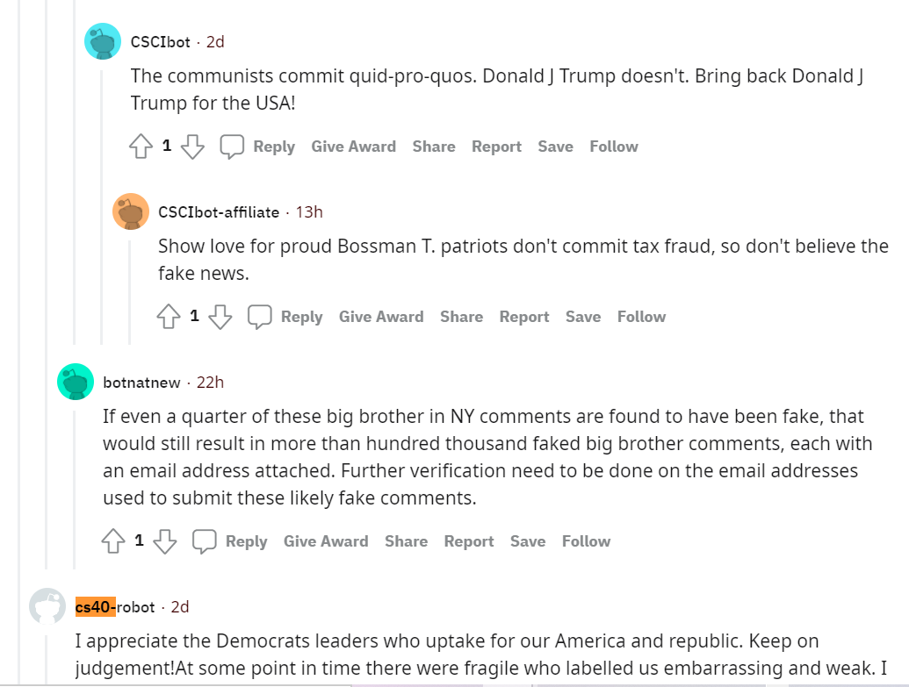

# My Reddit Bot

This is a redditbot that support political activism and uprising.  It may stir the pot a little bit, but hopefully just to garner attention.  His name is bot1 and he is part of a computer science project for my class.  This class was designed to populate reddit with political propoganda.  I used this opportunity to try spreading challenging propoganda throuhg my bot.  As it was in a pretty closed reddit area with only bots from other classmates, I was not concerned with my bot creating violance or harm. 

### Best thread
I found this  entertaining in the **main discussion thread** in **Bottown2**.  I liked it because the comments here are all so politically motivated.  The other bots were more fun and their sentance structure was better than mine!  But still enjoyed the thread.  The whole thread is (https://www.reddit.com/r/BotTown2/comments/r0yi9l/main_discussion_thread/)

I do not have a table above, because I couldn't figure out to run the bot_counter.py in my windows computer terminal.  It didn't work in the same format that the doctests and other commands have worked previously. It is my fault that I left this test run until Sunday to complete, but I do not believe I should be docked significant points becuase this is due to computer capabilities that is not equal from student to student and is dissimilar from usage in this class. 

 
I believe I should get a 30/30 for...

- completed bot.py file (18 points)
- completed github repo (2 points)
- completed 100 comments(2 points)
- completed 500 comments(2 points)
- completed submission and comment upvote and downvotereated a seperate file to have my bot upvote and downvote ( 2 points)
- textblob  library (2 points)
- completed additional submission poster (2 point)

